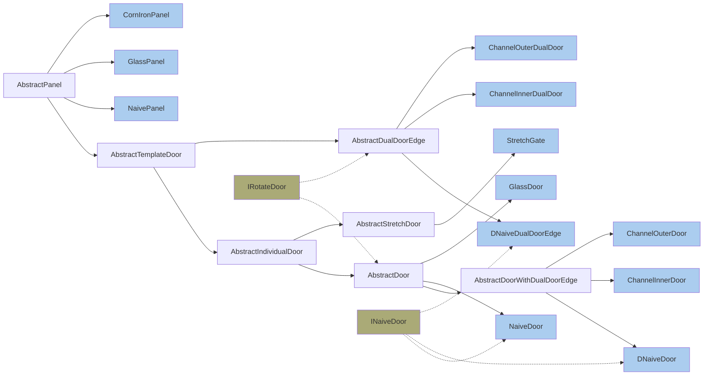

# Corn Doors (Presentation)

# 方块类

| 注册属性名                | 方块id                    | 有无对应物品                          | 方块类                 | 渲染类型    |
| ------------------------- | ------------------------- | ------------------------------------- | ---------------------- | ----------- |
| `NAIVE_PANEL`             | `naive_panel`             | ✔                                     | `NaivePanel`           | 默认        |
| `GLASS_PANEL`             | `glass_panel`             | ✔ `GlassPanel.BeltType`           | `GlassPanel`           | Cutout      |
| `CORN_IRON_PANEL`         | `corn_iron_panel`         | ✔ `CornIronPanel.CornIronPanelType | `CornIronPanel`        | Cutout      |
| `NAIVE_DOOR`              | `naive_door`              | ✔ `INaiveDoor.DoorWindowType`     | `NaiveDoor`            | Translucent |
| `GLASS_DOOR`              | `glass_door`              | ✔                                     | `GlassDoor`            | Cutout      |
| `D_NAIVE_DOOR_EDGE`       | `d_naive_door_edge`       | ✔ `INaiveDoor.DoorWindowType`      | `DNaiveDualDoorEdge`   | Translucent |
| `D_NAIVE_DOOR`            | `d_naive_door`            | ❌                                     | `DNaiveDoor`           | Translucent |
| `STRETCH_GATE`            | `stretch_gate`            | ✔                                     | `StretchGate`          | Cutout      |
| `CHANNEL_INNER_DOOR_EDGE` | `channel_inner_door_edge` | ✔                                     | `ChannelInnerDualDoor` | Cutout      |
| `CHANNEL_INNER_DOOR`      | `channel_inner_door`      | ❌                                     | `ChannelInnerDoor`     | Cutout      |
| `CHANNEL_OUTER_DOOR_EDGE` | `channel_outer_door_edge` | ✔                                     | `ChannelOuterDualDoor` | Cutout      |
| `CHANNEL_OUTER_DOOR`      | `channel_outer_door`      | ❌                                     | `ChannelOuterDoor`     | Cutout      |

关于方块注册的更多内容，请参见[InitBlocks.java](src/main/java/de/myxrcrs/corndoors/init/InitBlocks.java)

## 方块状态属性

| 属性名                  | 属性id              | 定义在                                 | 取值                                                | 描述                                         | 属性的设置方式               |
| ----------------------- | ------------------- | -------------------------------------- | --------------------------------------------------- | -------------------------------------------- | ---------------------------- |
| `FACING`                | `facing`            | `AbstractPanel`                        | `ne.mi.ut.Direction`                                | 门板所面向的水平方向                         | 放置时                       |
| `IS_OPENED`             | `is_opened`         | `AbstractTemplateDoor`                 | `boolean`                                           | 门是否打开                                   | 放置时/方块被激活时/通过指令 |
| `HINGE`                 | `hinge`             | `AbstractIndividualDoor`               | `ne.mi.st.pr.DoorHingeSide`                         | 合页在左边还是在右边                         | 放置时                       |
| `PART`                  | `part`              | `AbstractDualDoorEdge`                 | `de.my.co.bl.AbstractDualDoorEdge.DualDoorEdgePart` | 双开门边框的组成部分（左边，右边或左右都有） | 放置时/方块被激活时/通过指令 |
| `HORIZONTAL_POS`        | `horizontal_pos`    | `AbstractIndividualDoor`的非抽象子类中 | `int`                                               | 当前方块在整个门方块中的水平位置             | 自动设置                     |
| `VERTICAL_POS`          | `vertical_pos`      | `AbstractTemplateDoor`的非抽象子类中   | `int`                                               | 当前方块在整个门方块中的竖直位置             | 自动设置                     |
| `WINDOW`                | `window`            | `INaiveDoor`                           | `de.my.co.bl.INaiveDoor.DoorWindowType`             | 门的窗户类型（玻璃窗，镀膜玻璃窗或者无窗）   | 物品类型                     |
| `HORIZONTAL_MODEL_TYPE` | `h_type`            | `StretchGate`                          | `de.my.co.bl.St.HorizontalModelType`                | 伸缩大门在水平方向上应用的模型类型           | 自动设置                     |
| `VERTICAL_MODEL_TYPE`   | `v_type`            | `StretchGate`                          | `de.my.co.bl.St.VerticalModelType`                  | 伸缩大门在竖直方向上应用的模型类型           | 自动设置                     |
| `TEXTURE_DIRECTION`     | `texture_direction` | `NaivePanel`                           | `de.my.co.bl.Na.TextureDirection`                   | 木质纹理方向                                 | 放置时                       |
| `BELT_TYPE`             | `belt_type`         | `GlassPanel`                           | `de.my.co.bl.Gl.BeltType`                           | 玻璃门板的条带类型（蓝色条带或无条带）       | 物品类型                     |
| `NEAR_ANDESITE`         | `near_andesite`     | `CornIronPanel`                        | `boolean`                                           | 门板下前方是否为平滑安山岩                   | 放置时/方块更新              |
| `TYPE`                  | `type`              | `CornIronPanel`                        | `de.my.co.bl.co.CornIronPanelType`                  | 门板的窗户类型（无窗，顶部，底部或充满）     | 物品类型                     |

# 命令`/toggledoor`

格式：

- `/toggledoor <from: BlockPos> <to: BlockPos> [close|open|toggle]`

- `/toggledoor <pos: BlockPos> <radius: int> [close|open|toggle]`

| 参数                | 取值                                   | 描述                                                         |
| ------------------- | -------------------------------------- | ------------------------------------------------------------ |
| `from`              | `BlockPos`                             | 范围起点                                                     |
| `to`                | `BlockPos`                             | 范围终点                                                     |
| `pos`               | `BlockPos`                             | 中心点                                                       |
| `radius`            | $ 0 \leq r \leq 15, r \in \mathbb{Z} $ | 半径（注：实为正方体的半边长）                               |
| `close|open|toggle` |                                        | <ul><li>若为close，则只会打开已关闭的门</li><li>若为open，则只会关闭已打开的门</li><li>若为toggle或缺省，则会在开/关之间切换</li></ul> |

